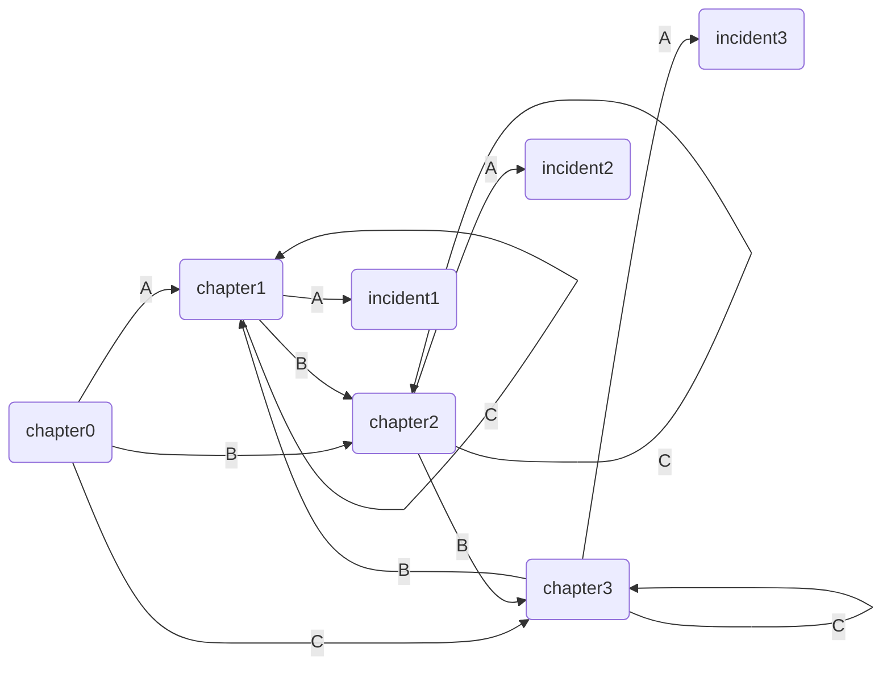

## 数据

> 不要手动实现一个个故事，建立一个数据文件，让程序自动创建他们。  


框架已经完成，本节将示例游戏数据的组织。  
新文件data.js(更合理的方式是使用json)  
- chapter数组: 创建Story类的参数
- incident数组: 创建Action类的参数

在这之前，需要完善一下与上节末尾Action对象联动的机制  
```javascript
// characters.js/Hero
  let superFail = me.fail;
  me.fail = function() {
    superFail();
    Vars.flag = -1;
    let str = [
      '你被击败了，但这没什么大不了的，不信点一下屏幕',
      '你输了，也许应该尝试其他的策略...'
      ];
    Func.add(Func.rand(str));
    Func.addF('（点击以继续）');
  };
// characters.js/Enemy
  let superFail = me.fail;
  me.fail = function() {
    superFail();
    Vars.flag = 1;
    Func.addF('（点击以继续）');
  };
// 然后，令Boss对象继承自Enemy

```

我们肯定不会希望，主人公一旦被击败就game over
一种方法是让他有N条命，另一种则是在击败后允许重新挑战，顺便记录一下失败次数:)  
```javascript
// global.js/Vars
// 顺便把eins和zwei弄成全局变量
  eins: {},
  zwei: {},
  snapshot: {},  // 记录主人公的各项属性信息

// global.js/Func
  setSnap: function() {
    let attrs = ['name', 'hp', 'ap', 'mp', 'sp', 'wp', 'sl'];
    for (let i = 0; i < attrs.length; ++i) {
      Vars.snapshot[attrs[i]] = Vars.eins[attrs[i]];
    }
  },
  reSnap: function() {
    Vars.eins = Hero(Vars.snapshot);
    Vars.eins.show();
  },


// stories.js/Action
  me.finish = function() {
    if (Vars.flag === 1) {  // 战斗胜利
      let idx = me.outcome;
      if (idx >= 0) {
        Func.select();
        Vars.iter = Story(chapter[idx]);
      } else {
        Vars.flag = 0;
        Vars.iter = Action(incident[-idx]);
      }
      Vars.iter.start();
    } else {  // Vars.flag === -1 战斗失败
      Func.reSnap();
      Vars.flag = 0;
      Vars.iter.start();
      let str = [
        '重新开始战斗...',
        '战斗数据重置...'
      ];
      Func.add(Func.rand(str));
    }
  };
```

优化一下UI，可以自定义主角姓名
```html
<!-- TEST.html/table/main -->
      <div>
        <label for="heorName">your name</label>
        <input id="heorName" type="text" placeholder="JOJO" />
        <button onclick="Func.gameStart()">start</button>
        <br />
        This is where the story tell.<br />
        Click to contain.<br />
      </div>
      <!-- 开始显示这些东西，调用Func.gameStart()之后，还是原来的主屏 -->

```
```javascript
// global.js/Func
  // 初始化游戏
  gameStart: function() {
    let heroName = document.getElementById('heorName').value || 'JOJO';
    Vars.iter = Story(chapter[0]);
    Vars.iter.start();
    Vars.eins = Hero({name: heroName, hp: 20, ap: 30, sp: 70, mp: 100});
    Vars.eins.sl = [1, 1, 1];
    Vars.eins.show();
    UI.main.addEventListener('click', Func.mainClick);
    // 不直接Vars.iter.next是因为会绑定到最开始的Story(chapter[0])上
  },
  mainClick: function() {
    Vars.iter.next();
  },
```

建立一个新的文件data.js  
在游戏框架成形后，几乎只需要改动这一个文件  
```javascript
// data.js
const chapter = [
  {
    content: [
      'hello',
      'chapter0',
      'Choose a item:<br />A=>chapter1<br />B=>chapter2<br />C=>chapter3'
    ],
    section: [1, 2, 3]
  },
  {
    content: [
      'chapter1',
      'Choose a item:<br />A=>incident1<br />B=>chapter2<br />C=>chapter1'
    ],
    section: [-1, 2, 1]
  },
  {
    content: [
      'chapter2',
      'Choose a item:<br />A=>incident2<br />B=>chapter3<br />C=>chapter2'
    ],
    section: [-2, 3, 2]
  },
  {
    content: [
      'chapter3',
      'Choose a item:<br />A=>incident3<br />B=>chapter1<br />C=>chapter3'
    ],
    section: [-3, 1, 3]
  }
];

const incident = [
  {  // incident0几乎不会用到，因为索引0指向了chapter0
    encounter: function() {
      Func.tell('nothing happend');
      Vars.iter = Story(chapter[0]);
    },
    outcome: 0
  },
  {  // 属性提升
    encounter: function() {
      Func.tell('incident1');
      Func.add('level up');
      Vars.eins.hp += 10;
      Vars.eins.ap += 5;
      Vars.eins.show();
      Vars.flag = 1;
    },
    outcome: 0
  },
  {  // 遭遇杂兵
    encounter: function() {
      Func.tell('incident2');
      Func.add('enemy appears');
      Vars.zwei = Enemy({name: 'ice cream', hp: 20, ap: 1});
      Vars.zwei.show();
    },
    outcome: 1
  },
  {  // 遭遇Boss
    encounter: function() {
      Func.tell('incident3');
      Func.add('boss appears');
      Vars.zwei = Boss({name: 'DIO', hp: 100, mp: 100, ap: 20, sp: 20});
      Vars.zwei.skill('BOOOOOM!',  // 设置Boss技能
        function(target) {
        if (!this.hp || !target.hp) return;
        target.hp -= 100;
        Func.add('BOOOOOM!');
        target.check();
        },
        function(damage){
          return 0;
        }
      );
      Vars.zwei.show();
    },
    outcome: 1
  },
];
```

流程图大致是这个亚子（不知道能不能看= =）


这就是一个简单的游戏框架了，剩下的就是完善data.js，在chapter中述说你的故事，定义Action.encounter构思一个奇遇，使用Boss.skill快速给坏蛋添加技能...  
程序是渺小的，想象力是无限的。  
```javascript
// 一个例子
vars.zwei.layer = 0;
Vars.zwei.skill('[奥术冲击][奥术飞弹][唤醒][法力护盾]',
  function(target) {
    if (!this.hp || !target.hp) return;
    let damage, str;
    let mana = 10, factor = 1;
    for (let i = 0; i < this.layer; ++i) {
      mana *= 1.5;
      factor *= 2;
    }
    mana = Math.floor(mana);
    if (mana <= this.mp) {
      damage = this.sp * factor;
      this.mp -= mana;
      this.layer += 1;
      str = this.name + '使用了奥术冲击(' + this.layer
        + ')，对' + target.name + '造成了' + damage + '点魔法伤害';
    } else {
      let random = Math.floor(Math.random() * 3);
      if (random) {
        this.mp += mana * random;
        this.layer -= random;
        this.layer -= random;
        str = this.name + '施放了[唤醒]，恢复了' + mana * random + '点法力值';
      } else {
        damage = target.defend(Math.floor(this.sp / this.layer));
        str = this.name + '使用了[奥术飞弹]，对'
          + target.name + '造成了' + damage + '点物理伤害';
        this.mp += Math.floor(mana / 2);
      }
    }
    Func.add(str);
    target.hp -= damage;
    target.check();
    me.show();
  },
  function(damage) {
    if (damage <= this.mp) {
      this.mp -= Math.floor(damage / this.layer);
      return 0;
    } else {
      this.mp *= this.layer;
      return damage;
    }
  },
);
```
