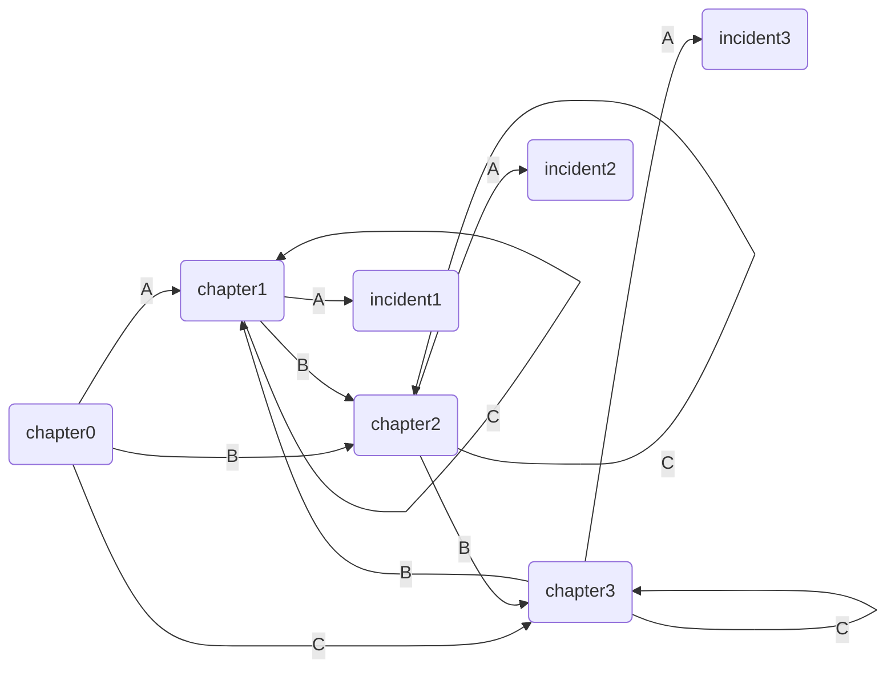

## 网页

> JavaScript是一种非常随意的语言。  
> 重要的是一个对象能做什么，而不是它从何而来。  


本节设计了游戏中产生角色的模版。  
- “抽象类”：Charact
- 主角Hero：拥有多种属性、装备、主动施放的
- 杂兵Enemy：只有最基本的属性
- 坏人首领Boss：使用技能替换基本攻击，可为每个实例编写不同的技能

```javascript
//Hero
  let superFail = me.fail;
  me.fail = function() {
    superFail();
    Vars.flag = -1;
    let str = [
      '你被击败了，但这没什么大不了的，不信点一下屏幕',
      '你输了，也许应该尝试其他的策略...'
      ];
    Func.add(Func.rand(str));
    Func.addF('（点击以继续）');
  };
  // Enemy
  let superFail = me.fail;
  me.fail = function() {
    superFail();
    Vars.flag = 1;
    Func.addF('（点击以继续）');
  };

```


```javascript
const chapter = [
  {
    content: [
      'hello',
      'chapter0',
      'Choose a item:<br />A=>chapter1<br />B=>chapter2<br />C=>chapter3'
    ],
    section: [1, 2, 3]
  },
  {
    content: [
      'chapter1',
      'Choose a item:<br />A=>incident1<br />B=>chapter2<br />C=>chapter1'
    ],
    section: [-1, 2, 1]
  },
  {
    content: [
      'chapter2',
      'Choose a item:<br />A=>incident2<br />B=>chapter3<br />C=>chapter2'
    ],
    section: [-2, 3, 2]
  },
  {
    content: [
      'chapter3',
      'Choose a item:<br />A=>incident3<br />B=>chapter1<br />C=>chapter3'
    ],
    section: [-3, 1, 3]
  }
];

const incident = [
  {
    encounter: function() {
      Func.tell('nothing happend');
      Vars.iter = Story(chapter[0]);
    },
    outcome: 0
  },
  {
    encounter: function() {
      Func.tell('incident1');
      Func.add('level up');
      Vars.eins.hp += 10;
      Vars.eins.ap += 5;
      Vars.eins.show();
      Vars.flag = 1;
    },
    outcome: 0
  },
  {
    encounter: function() {
      Func.tell('incident2');
      Func.add('enemy appears');
      Vars.zwei = Enemy({name: 'ice cream', hp: 20, ap: 1});
      Vars.zwei.show();
    },
    outcome: 1
  },
  {
    encounter: function() {
      Func.tell('incident3');
      Func.add('boss appears');
      Vars.zwei = Boss({name: 'DIO', hp: 100, mp: 100, ap: 20, sp: 20});
      Vars.zwei.skill('BOOOOOM!',
        function(target) {
        if (!this.hp || !target.hp) return;
        target.hp -= 100;
        Func.add('BOOOOOM!');
        target.check();
        },
        function(damage){
          return 0;
        }
      );
      Vars.zwei.show();
    },
    outcome: 1
  },
];
```



```javascript
  eins: {},
  zwei: {},
  snapshot: {},


  setSnap: function() {
    let attrs = ['name', 'hp', 'ap', 'mp', 'sp', 'wp', 'sl'];
    for (let i = 0; i < attrs.length; ++i) {
      Vars.snapshot[attrs[i]] = Vars.eins[attrs[i]];
    }
  },
  reSnap: function() {
    Vars.eins = Hero(Vars.snapshot);
    Vars.eins.show();
  },
```

```html
      <div>
        <label for="heorName">your name</label>
        <input id="heorName" type="text" placeholder="JOJO" />
        <button onclick="Func.gameStart()">start</button>
        <br />
        This is where the story tell.<br />
        Click to contain.<br />
      </div>

```
```javascript
  gameStart: function() {
    let heroName = document.getElementById('heorName').value || 'JOJO';
    Vars.iter = Story(chapter[0]);
    Vars.iter.start();
    Vars.eins = Hero({name: heroName, hp: 20, ap: 30, sp: 70, mp: 100});
    Vars.eins.sl = [1, 1, 1];
    Vars.eins.show();
    UI.main.addEventListener('click', Func.mainClick);
  },
  mainClick: function() {
    Vars.iter.next();
  },

```
